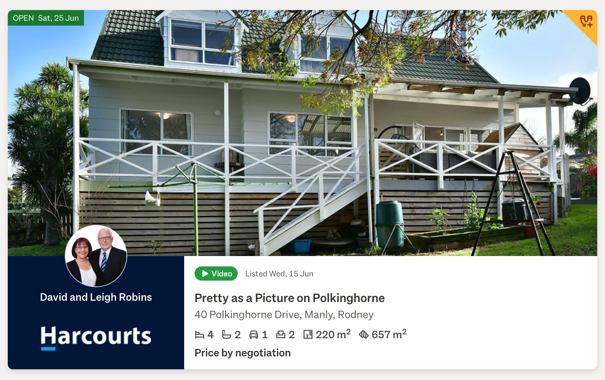
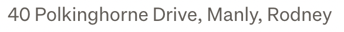
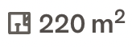
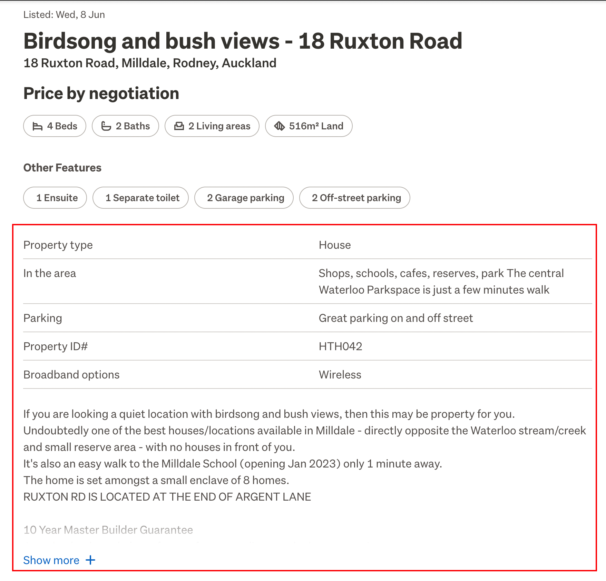
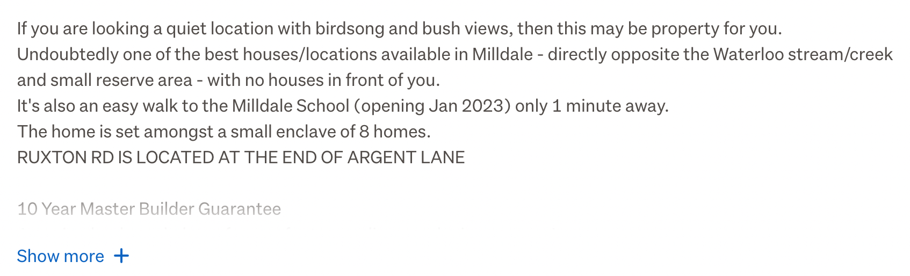
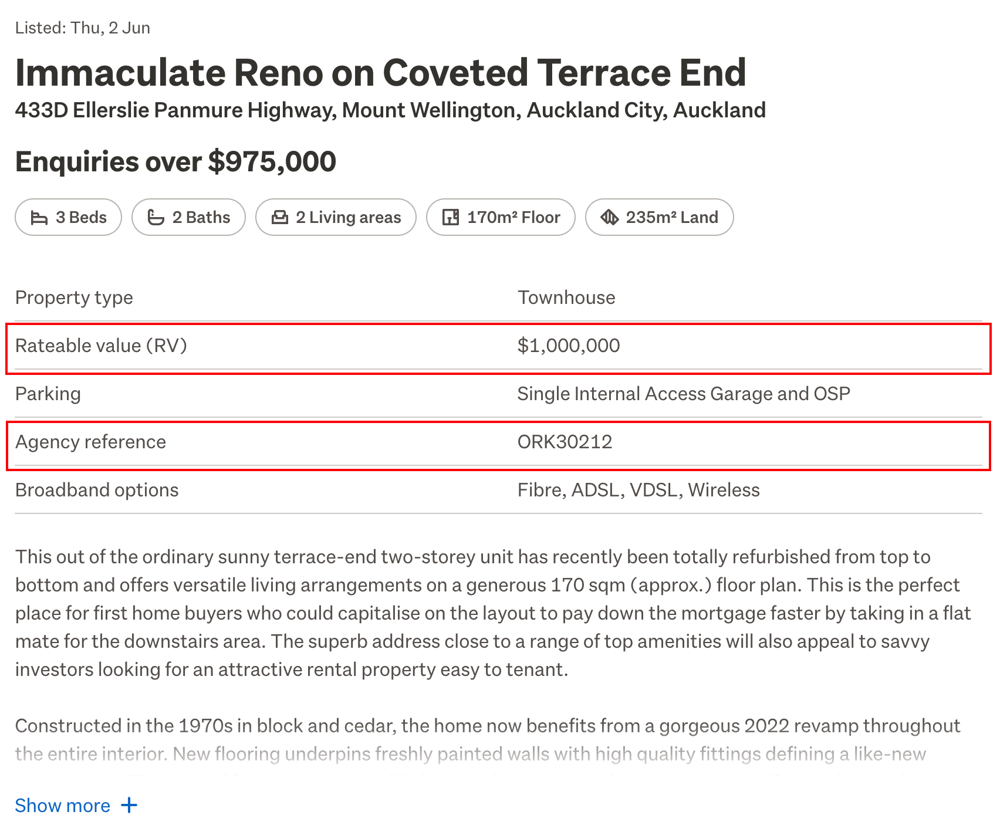

# webscrappe-trademe-co-nz-property

[](https://github.com/ankursoni/webscrappe-trademe-co-nz-property/actions/workflows/build.yml)
[](https://codecov.io/gh/ankursoni/webscrappe-trademe-co-nz-property)
[](https://github.com/psf/black)
[](/LICENSE)


> Web scrapping project for trademe.co.nz/property


## Built With

- Python v3.9.13
- Flask
- Docker
- Helm chart & Kubernetes


## Getting Started

To get a local copy up and running, follow these simple example steps.

### Prerequisites
Python v3.9.13  
Docker (optional)  
Helm chart and Kubernetes (optional)

### Setup
```sh
# create a virtual environment
# assuming you have "python3 --version" = "Python 3.9.13" installed in the current terminal session
python3 -m venv ./venv

# activate virtual environment
# for macos or linux
source ./venv/bin/activate
# for windows
.\venv\Scripts\activate

# upgrade pip
python -m pip install --upgrade pip

# install python dependencies
pip install -r requirements.txt

# lint python code
pylint ./search
```

### Install
1. Run as cli:
```sh
# argument 1 = city
# argument 2 = total number of pages
# argument 3 = true or false (default) to do search 'with detail' or 'without detail'
# argument 4 = output file (default = result.psv)
# argument 5 = true or false (default) to enable debug mode logging
# e.g. python -m search.main <city> <total pages> <true or false> <file.psv> <true or false>
python -m search.main auckland 1 false result.psv
```
2. Or, run as web api server:
```sh
FLASK_ENV=development python3 -m search.app
```
3. Or, build and run in docker container:
```sh
# build docker image
docker build -t webscrappe-trademe-co-nz-property:mvp .

# run docker container
docker run -d -p 8080:8080 --name webscrappe webscrappe-trademe-co-nz-property:mvp

# stop and remove docker container
docker stop webscrappe
docker rm webscrappe
```

4. Or, run in kubernetes cluster:
```sh
# upgrade or install helm chart, if not preset
cd .deploy/helm
helm upgrade -i webscrappe-trademe-co-nz-property webscrappe-trademe-co-nz-property \
	-n webscrappe --create-namespace

# stop and remove helm chart and namespace
helm uninstall webscrappe-trademe-co-nz-property -n webscrappe
kubectl delete namespace webscrappe
```

### Usage
When running as a command line interface (cli):
```sh
# argument 1 = city
# argument 2 = total number of pages
# argument 3 = true or false (default) to do search 'with detail' or 'without detail'
# argument 4 = output file (default = result.psv)
# argument 5 = true or false (default) to enable debug mode logging
# e.g. python -m search.main <city> <total pages> <true or false> <file.psv> <true or false>
python -m search.main auckland 1 false result.psv
```
NOTE: the output result.psv file needs to be imported with a custom Delimiter or Separator type - `|` in the import CSV wizard.

When running as an api, use the following endpoints:
1. 'http://`{domain name}:{port}`/search-without-detail/`{city}`/`{total number of pages}`' searching without property detail.
```sh
# example
curl http://localhost:8080/search-without-detail/auckland/1
```
2. 'http://`{domain name}:{port}`/search-with-detail/`{city}`/`{total number of pages}`' searching with property detail.
```sh
# example
curl http://localhost:8080/search-with-detail/auckland/1
```

### Mapping of columns
An example property search page lists property as follows:

The fields in PSV are mapped as follows:
- title  

- address  

- number_of_bedrooms  

- number_of_bathrooms  

- number_of_parking_lots  

- number_of_living_areas  

- floor_area_sqm  

- land_area_sqm  

- asking_price  


Another example property detail page shows property as follows:

The fields in PSV are mapped as follows:
- property_type  

- parking_type  

- in_the_area  

- property_id  

- broadband_options  

- description  


Another example property detail page shows property as follows:

More fields in PSV are mapped as follows:
- rateable_value  

- agency_reference  


### Run tests
```sh
# run unit tests
pytest -v --cov=search
```


## Authors

👤 **Ankur Soni**

[](https://github.com/ankursoni)

[](https://linkedin.com/in/ankursoniji)

[](https://twitter.com/ankursoniji)


## 🤝 Contributing

Contributions, issues, and feature requests are welcome!

Feel free to check the [issues page](../../issues/).


## Show your support

Give a ⭐️ if you like this project!


## 📝 License

This project is [MIT](./LICENSE) licensed.